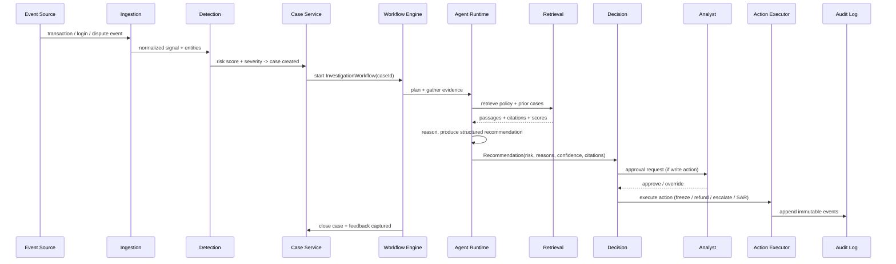

# Investigation data flow (happy path)

```mermaid
sequenceDiagram
  participant Src as Event Source
  participant Ing as Ingestion
  participant Det as Detection
  participant Case as Case Service
  participant WF as Workflow Engine
  participant Ag as Agent Runtime
  participant RAG as Retrieval
  participant Dec as Decision
  participant Hum as Analyst
  participant Act as Action Executor
  participant Aud as Audit Log

  Src->>Ing: transaction / login / dispute event
  Ing->>Det: normalized signal + entities
  Det->>Case: risk score + severity -> case created
  Case->>WF: start InvestigationWorkflow(caseId)
  WF->>Ag: plan + gather evidence
  Ag->>RAG: retrieve policy + prior cases
  RAG-->>Ag: passages + citations + scores
  Ag->>Ag: reason, produce structured recommendation
  Ag->>Dec: Recommendation(risk, reasons, confidence, citations)
  Dec->>Hum: approval request (if write action)
  Hum-->>Dec: approve / override
  Dec->>Act: execute action (freeze / refund / escalate / SAR)
  Act->>Aud: append immutable events
  WF->>Case: close case + feedback captured
```
