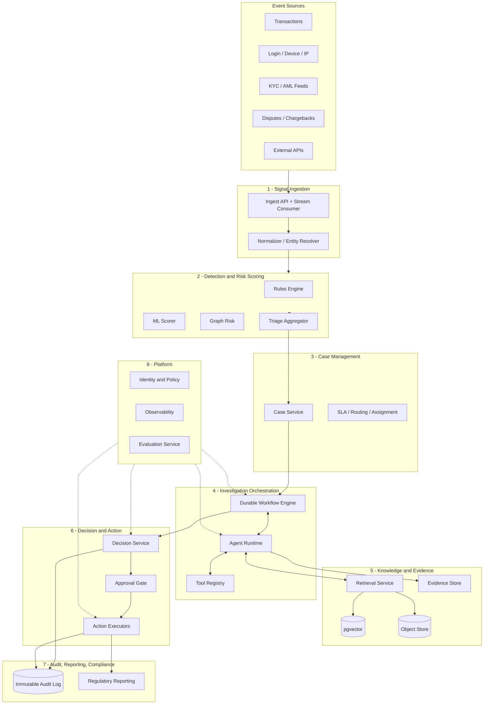

```mermaid
flowchart TB
  subgraph SRC[Event Sources]
    TX[Transactions]
    LG[Login / Device / IP]
    KY[KYC / AML Feeds]
    DS[Disputes / Chargebacks]
    EX[External APIs]
  end

  subgraph P1[1 - Signal Ingestion]
    ING[Ingest API + Stream Consumer]
    NRM[Normalizer / Entity Resolver]
  end

  subgraph P2[2 - Detection and Risk Scoring]
    RUL[Rules Engine]
    MLS[ML Scorer]
    GRF[Graph Risk]
    TRI[Triage Aggregator]
  end

  subgraph P3[3 - Case Management]
    CSM[Case Service]
    SLA[SLA / Routing / Assignment]
  end

  subgraph P4[4 - Investigation Orchestration]
    ORC[Durable Workflow Engine]
    AGT[Agent Runtime]
    TRG[Tool Registry]
  end

  subgraph P5[5 - Knowledge and Evidence]
    RAG[Retrieval Service]
    EVD[Evidence Store]
    VDB[(pgvector)]
    OBJ[(Object Store)]
  end

  subgraph P6[6 - Decision and Action]
    DEC[Decision Service]
    APV[Approval Gate]
    ACT[Action Executors]
  end

  subgraph P7[7 - Audit, Reporting, Compliance]
    AUD[(Immutable Audit Log)]
    RPT[Regulatory Reporting]
  end

  subgraph P8[8 - Platform]
    IAM[Identity and Policy]
    OBS[Observability]
    EVL[Evaluation Service]
  end

  SRC --> ING --> NRM --> P2
  P2 --> TRI --> CSM
  CSM --> ORC
  ORC <--> AGT
  AGT <--> TRG
  AGT <--> RAG
  RAG --> VDB
  RAG --> OBJ
  AGT --> EVD
  ORC --> DEC --> APV --> ACT
  DEC --> AUD
  ACT --> AUD
  ACT --> RPT
  P8 -.-> ORC
  P8 -.-> AGT
  P8 -.-> ACT
  P8 -.-> DEC
```
